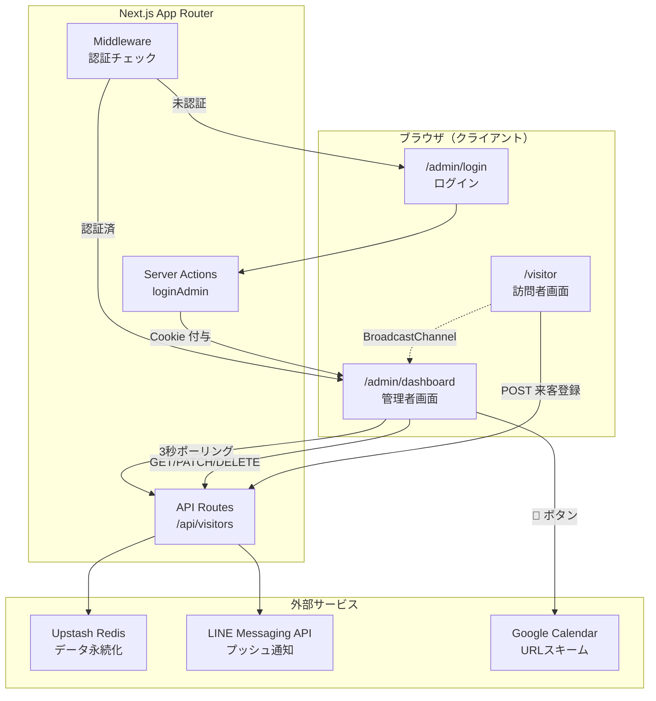
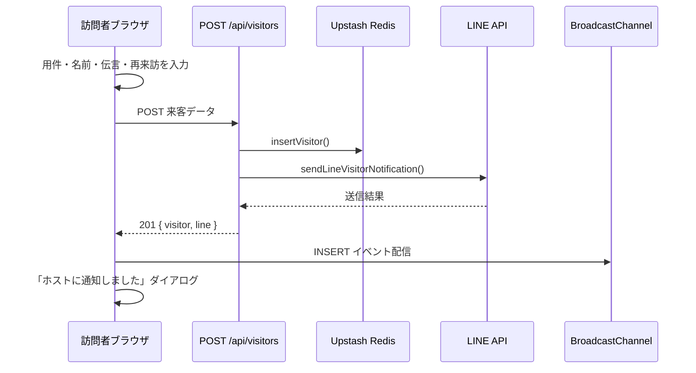
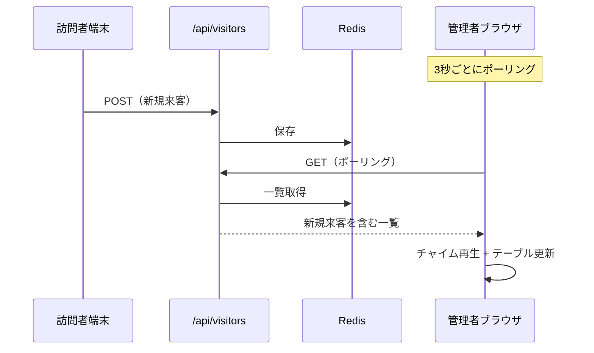
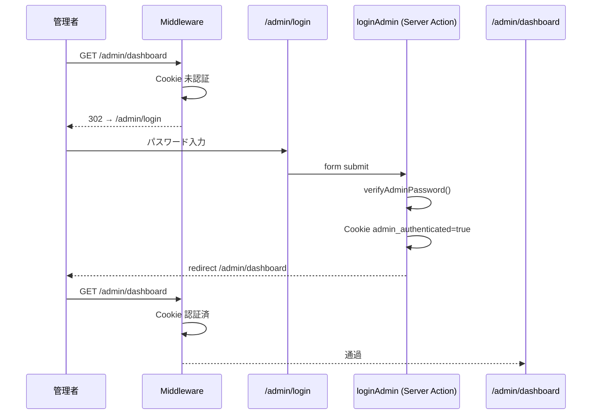

# QRコード来客応対システム — 技術説明書

本資料は、Next.js (App Router) + TypeScript + Tailwind CSS + shadcn/ui で構築した  
**来客受付 Web アプリケーション** の設計・実装内容を説明するものです。

---

## 目次

1. [システム概要](#1-システム概要)
2. [技術スタック](#2-技術スタック)
3. [ディレクトリ構成](#3-ディレクトリ構成)
4. [画面・URL 設計](#4-画面url-設計)
5. [データモデル](#5-データモデル)
6. [環境変数](#6-環境変数)
7. [処理フロー](#7-処理フロー)
8. [モジュール詳細](#8-モジュール詳細)
9. [API 仕様](#9-api-仕様)
10. [リアルタイム同期](#10-リアルタイム同期)
11. [LINE 通知（パターンC）](#11-line-通知パターンc)
12. [管理者認証（Middleware 方式）](#12-管理者認証middleware-方式)
13. [データ永続化（Upstash Redis）](#13-データ永続化upstash-redis)
14. [ローカル開発・デプロイ](#14-ローカル開発デプロイ)
15. [今後の拡張ポイント](#15-今後の拡張ポイント)

---

## 1. システム概要

### 目的

オフィスや店舗の受付で、訪問者が QR コードから来客情報を登録し、  
管理者（ホスト）がダッシュボードで対応状況を管理するためのシステムです。

### 主要機能

| 機能 | 説明 |
|------|------|
| 訪問者受付 | 用件・名前・伝言・再来訪予定を入力してホストへ通知 |
| 管理者ダッシュボード | 来客履歴の一覧、ステータス管理、削除 |
| リアルタイム更新 | 新規来客時に管理画面が自動更新＋チャイム再生 |
| LINE 通知 | 来客登録時にホストの LINE へプッシュ通知 |
| Google カレンダー連携 | 再来訪予定をカレンダーに登録 |
| 管理者認証 | パスワード + Middleware によるダッシュボード保護 |

### システム構成図



---

## 2. 技術スタック

| カテゴリ | 採用技術 |
|---------|---------|
| フレームワーク | Next.js 15（App Router） |
| 言語 | TypeScript |
| スタイリング | Tailwind CSS 3 |
| UI コンポーネント | shadcn/ui（Radix UI ベース） |
| データストア | Upstash Redis（本番）/ インメモリ（ローカル） |
| 通知 | LINE Messaging API |
| 認証 | Cookie + Middleware |
| ホスティング | Vercel（想定） |

### 主要 npm パッケージ

- `next`, `react`, `react-dom` — アプリ基盤
- `@upstash/redis` — サーバーレス環境向け Redis クライアント
- `@radix-ui/react-*` — Dialog, Select, AlertDialog 等
- `react-day-picker`, `date-fns` — 再来訪日時ピッカー
- `lucide-react` — アイコン
- `class-variance-authority`, `clsx`, `tailwind-merge` — スタイルユーティリティ

---

## 3. ディレクトリ構成

```
visitor-reception/
├── docs/
│   └── SYSTEM_DOCUMENTATION.md   ← 本資料
├── src/
│   ├── app/                      ← App Router（ページ・API）
│   │   ├── page.tsx              → / （/visitor へリダイレクト）
│   │   ├── layout.tsx            → ルートレイアウト
│   │   ├── globals.css
│   │   ├── visitor/
│   │   │   ├── layout.tsx        → 訪問者専用レイアウト
│   │   │   └── page.tsx          → /visitor
│   │   ├── admin/
│   │   │   ├── layout.tsx        → 管理者エリア共通レイアウト
│   │   │   ├── login/
│   │   │   │   ├── page.tsx      → /admin/login
│   │   │   │   └── actions.ts    → ログイン Server Action
│   │   │   └── dashboard/
│   │   │       └── page.tsx      → /admin/dashboard
│   │   └── api/
│   │       └── visitors/
│   │           ├── route.ts      → GET / POST
│   │           └── [id]/
│   │               └── route.ts  → PATCH / DELETE
│   ├── components/
│   │   ├── visitor-form.tsx      → 訪問者入力フォーム
│   │   ├── admin-dashboard.tsx   → 管理者ダッシュボード
│   │   ├── admin-login-form.tsx  → ログインフォーム
│   │   ├── return-visit-picker.tsx → 再来訪日時選択
│   │   └── ui/                   → shadcn/ui コンポーネント
│   ├── hooks/
│   │   └── use-visitors.ts       → 来客データ取得・更新フック
│   ├── lib/
│   │   ├── types.ts              → 型定義
│   │   ├── admin-auth.ts         → 管理者認証ロジック
│   │   ├── line.ts               → LINE 通知
│   │   ├── google-calendar.ts    → Google カレンダー URL 生成
│   │   ├── chime.ts              → 通知チャイム（Web Audio API）
│   │   ├── realtime.ts           → BroadcastChannel リアルタイム
│   │   ├── visitor-storage.ts    → 日時フォーマット等ユーティリティ
│   │   ├── utils.ts              → cn() 等
│   │   └── db/
│   │       ├── redis.ts          → Upstash Redis クライアント
│   │       └── visitors.ts       → 来客 CRUD
│   └── middleware.ts             → 管理者ルート保護
├── .env.example
├── .env.local                    ← ローカル用（Git 管理外）
└── package.json
```

---

## 4. 画面・URL 設計

| URL | アクセス制限 | 内容 |
|-----|-------------|------|
| `/` | なし | `/visitor` へ自動リダイレクト |
| `/visitor` | **なし（誰でも可）** | 来客入力フォーム |
| `/admin` | Middleware | 認証状態に応じ login / dashboard へ転送 |
| `/admin/login` | Middleware | パスワード入力・ログイン |
| `/admin/dashboard` | **要認証** | ステータスカード・履歴テーブル |
| `/admin/qr` | **要認証** | 訪問者画面（`/visitor`）への QR コード表示・PNG ダウンロード |

### 画面分離の方針

- 訪問者 UI と管理者 UI は **完全に別 URL** として独立
- 訪問者画面には管理者へのリンクを置かない（QR コードは `/visitor` のみ想定）
- 管理者画面は Middleware + Cookie により保護

---

## 5. データモデル

### Visitor 型（`src/lib/types.ts`）

```typescript
interface Visitor {
  id: string;                        // UUID
  created_at: string;                // ISO 8601 日時
  purpose: Purpose;                  // 用件
  visitor_name: string;              // 訪問者名
  message: string;                   // 伝言
  status: Status;                  // 対応ステータス
  return_visit_scheduled_at: string | null;  // 再来訪予定（ISO 8601 / null）
}
```

### 用件（Purpose）

`"配達" | "アポあり" | "集金・営業" | "その他"`

### ステータス（Status）

`"未対応" | "対応中" | "対応済み"`

新規登録時のデフォルトステータスは **「未対応」** です。

### Redis 上の保存形式

- キー: `visitor-reception:visitors`
- 値: `Visitor[]`（JSON 配列）
- 初回アクセス時にモックデータ 4 件を自動投入

---

## 6. 環境変数

| 変数名 | 必須 | 用途 |
|--------|------|------|
| `LINE_CHANNEL_ACCESS_TOKEN` | 本番推奨 | LINE Messaging API トークン |
| `LINE_USER_ID` | 本番推奨 | 通知先 LINE ユーザー ID |
| `NEXT_PUBLIC_APP_URL` | 本番推奨 | LINE 通知内ダッシュボード URL のベース |
| `ADMIN_PASSWORD` | 本番推奨 | 管理者ログインパスワード |
| `UPSTASH_REDIS_REST_URL` | Vercel 必須 | Upstash Redis REST URL |
| `UPSTASH_REDIS_REST_TOKEN` | Vercel 必須 | Upstash Redis REST トークン |

### フォールバック動作

| 変数 | 未設定時の動作 |
|------|---------------|
| `ADMIN_PASSWORD` | `admin123` でログイン可能 |
| `NEXT_PUBLIC_APP_URL` | `http://localhost:3000` を使用 |
| `LINE_*` | console.log でモック出力（送信スキップ） |
| `UPSTASH_*` | インメモリ DB（ローカル開発用） |

---

## 7. 処理フロー

### 7.1 訪問者が来客を登録する流れ



### 7.2 管理者画面が更新される流れ



**同一 PC の別タブ** では、BroadcastChannel による即時更新も動作します。

### 7.3 管理者ログインの流れ



---

## 8. モジュール詳細

### 8.1 訪問者画面 — `visitor-form.tsx`

**役割:** 来客情報の入力と送信（Client Component）

| 要素 | 実装 |
|------|------|
| 用件選択 | 4 つの大きなボタン（2×2 グリッド） |
| 名前 | Input（必須） |
| 伝言 | Textarea（任意） |
| 再来訪予定 | `ReturnVisitPicker`（Popover + Calendar + 時刻） |
| 送信 | `POST /api/visitors` → 成功後 BroadcastChannel で INSERT 通知 |
| 完了表示 | shadcn Dialog「ホストに通知しました」 |

**設計ポイント:** 管理画面用の `useVisitors` フックは使わず、送信専用の `submitVisitor()` 関数に分離しています。

---

### 8.2 管理者ダッシュボード — `admin-dashboard.tsx`

**役割:** 来客履歴の閲覧・操作（Client Component）

| 要素 | 実装 |
|------|------|
| 上部カード | 未対応数 / 総来客数 / 最終来客時間 |
| 履歴テーブル | 日時・用件(Badge)・名前・伝言・再来訪・ステータス・アクション |
| ステータス変更 | Select ドロップダウン → `PATCH /api/visitors/[id]` |
| カレンダー登録 | 📅 ボタン → Google Calendar URL を別タブで開く |
| 削除 | 🗑 ボタン → AlertDialog 確認 → `DELETE /api/visitors/[id]` |
| リアルタイム | `useVisitors({ playChimeOnInsert: true, enablePolling: true })` |

---

### 8.3 管理者ログイン — `admin-login-form.tsx` + `actions.ts`

**役割:** パスワード認証と Cookie 付与

- **Client:** `useActionState` で Server Action を呼び出し、エラーを赤文字表示
- **Server Action (`loginAdmin`):**
  1. パスワードを `verifyAdminPassword()` で検証
  2. 成功時 `admin_authenticated=true` Cookie を HttpOnly で設定（7 日間）
  3. `/admin/dashboard` へ redirect

---

### 8.4 Middleware — `middleware.ts`

**役割:** 管理者ルートへの未認証アクセスを遮断

| パス | 未認証 | 認証済 |
|------|--------|--------|
| `/admin/dashboard/*` | → `/admin/login?from=...` | 通過 |
| `/admin/qr` | → `/admin/login?from=...` | 通過 |
| `/admin/login` | 通過 | → `/admin/dashboard` |
| `/admin` | → `/admin/login` | → `/admin/dashboard` |

`/visitor` および `/api/*` は Matcher 対象外のため **保護されません**。

---

### 8.5 データ層 — `lib/db/visitors.ts`

**役割:** 来客データの CRUD

| 関数 | 説明 |
|------|------|
| `listVisitors()` | 一覧取得（新しい順） |
| `findVisitor(id)` | ID 検索 |
| `insertVisitor(data)` | 新規登録（status = 未対応） |
| `patchVisitorStatus(id, status)` | ステータス更新 |
| `removeVisitor(id)` | 削除 |

**ストレージ切り替え:**

```
Upstash 環境変数あり → Redis に read/write
Upstash 未設定       → globalThis インメモリ（ローカル開発用）
```

---

### 8.6 リアルタイム — `lib/realtime.ts` + `hooks/use-visitors.ts`

**BroadcastChannel（同一オリジン・別タブ間）**

| イベント | タイミング |
|---------|-----------|
| `INSERT` | 新規来客登録時 |
| `UPDATE` | ステータス変更時 |
| `DELETE` | 履歴削除時 |

**ポーリング（Vercel 本番向け）**

- 管理画面で **3 秒間隔** で `GET /api/visitors`
- 新規 ID を検出した場合にチャイム再生
- スマホ → PC など **別端末間** の同期を実現

**チャイム — `lib/chime.ts`**

- Web Audio API で「ピン（880Hz）→ ポーン（1174Hz）」を生成
- 外部音声ファイル不要

---

### 8.7 LINE 通知 — `lib/line.ts`

**パターンC 文面テンプレート:**

```
🔔【来客がありました】
{用件} {名前} 様
伝言：「{伝言}」
再来訪予定：{日時}

👇ダッシュボードで対応ステータスを変更する
{NEXT_PUBLIC_APP_URL}/admin/dashboard
```

**未入力時のフォールバック:**

| 項目 | フォールバック |
|------|---------------|
| 名前 | `未入力` |
| 伝言 | `なし` |
| 再来訪予定 | `なし` |

LINE 送信失敗時も **来客登録自体は成功** します（エラーを返すが 201 は維持）。

---

### 8.8 Google カレンダー — `lib/google-calendar.ts`

再来訪予定がある行の 📅 ボタンから、以下 URL を別タブで開きます。

```
https://calendar.google.com/calendar/render?action=TEMPLATE
  &text=再来訪：{用件} {名前}様
  &dates={開始}/{終了}（1時間）
  &details={伝言}
```

---

## 9. API 仕様

### `GET /api/visitors`

来客一覧を返します。

**Response 200:**
```json
{
  "visitors": [ { "id": "...", "created_at": "...", ... } ]
}
```

---

### `POST /api/visitors`

新規来客を登録し、LINE 通知を送信します。

**Request Body:**
```json
{
  "purpose": "配達",
  "visitor_name": "山田 太郎",
  "message": "荷物をお届けに参りました",
  "return_visit_scheduled_at": "2026-07-10T05:00:00.000Z"
}
```

**Response 201:**
```json
{
  "visitor": { ... },
  "line": { "sent": true, "mock": false }
}
```

---

### `PATCH /api/visitors/[id]`

ステータスを更新します。

**Request Body:**
```json
{ "status": "対応中" }
```

---

### `DELETE /api/visitors/[id]`

来客履歴を 1 件削除します。

**Response 200:**
```json
{ "success": true, "id": "..." }
```

---

## 10. リアルタイム同期

### なぜ二重の仕組みがあるか

| 方式 | 有効な場面 | 限界 |
|------|-----------|------|
| BroadcastChannel | 同一 PC の別タブ | 別端末・別ブラウザでは不可 |
| ポーリング（3秒） | Vercel 本番・別端末 | 最大 3 秒の遅延 |

Vercel のサーバーレス環境では WebSocket や Supabase Realtime を使わず、  
**ポーリング + BroadcastChannel** の組み合わせで Supabase Realtime 相当の UX を模倣しています。

---

## 11. LINE 通知（パターンC）

### 送信タイミング

`POST /api/visitors` 成功後、サーバー側で `sendLineVisitorNotification()` を実行。

### エンドポイント

```
POST https://api.line.me/v2/bot/message/push
Authorization: Bearer {LINE_CHANNEL_ACCESS_TOKEN}
```

### モック動作

環境変数未設定時は API を呼ばず、ターミナルに送信内容を `console.log` 出力します。

---

## 12. 管理者認証（Middleware 方式）

### 採用理由（案1）

- Next.js Middleware で **ルート単位** にアクセス制御
- 訪問者画面（`/visitor`）には一切影響しない
- Server Action + HttpOnly Cookie で XSS 耐性を確保

### Cookie 仕様

| 項目 | 値 |
|------|-----|
| 名前 | `admin_authenticated` |
| 値 | `true` |
| HttpOnly | `true` |
| Secure | 本番のみ `true` |
| SameSite | `Lax` |
| 有効期限 | 7 日 |

### セキュリティ上の注意

- 本番環境では必ず `ADMIN_PASSWORD` を強固な値に設定してください
- デフォルト `admin123` は開発用フォールバックです
- API ルート（`/api/visitors`）は現状 **認証なし** です（訪問者 POST のため）

---

## 13. データ永続化（Upstash Redis）

### Vercel で Redis が必要な理由

Vercel のサーバーレス関数は **リクエストごとに別インスタンス** になることがあり、  
インメモリ DB では POST と GET でデータが共有されません。

Upstash Redis により全インスタンスが同一データを参照します。

### 接続方法

1. Vercel プロジェクト → **Storage** → **Upstash Redis** を Connect
2. `UPSTASH_REDIS_REST_URL` / `UPSTASH_REDIS_REST_TOKEN` が自動設定
3. Redeploy

### ローカル開発

Redis 未設定時は `globalThis.__visitorDb` によるインメモリ DB が使われ、  
`npm run dev` 単体で動作確認できます。

---

## 14. ローカル開発・デプロイ

### ローカル起動

```bash
npm install
cp .env.example .env.local
# .env.local を編集
npm run dev
```

| URL | 用途 |
|-----|------|
| http://localhost:3000/visitor | 訪問者画面 |
| http://localhost:3000/admin/login | 管理者ログイン |
| http://localhost:3000/admin/dashboard | ダッシュボード |

### 外部公開（一時 URL）

```bash
# ターミナル1
npm run dev:external

# ターミナル2
npm run tunnel
```

Cloudflare Tunnel により `*.trycloudflare.com` URL が発行されます。

### Vercel デプロイ

- リポジトリ: `inatomiyouto-cloud/visitor-reception`
- ブランチ: `preview`（プレビュー URL 運用）
- 必須環境変数: `ADMIN_PASSWORD`, `LINE_*`, `NEXT_PUBLIC_APP_URL`, Upstash Redis

### QR コード用 URL 例

```
訪問者: https://your-domain.vercel.app/visitor
管理者: https://your-domain.vercel.app/admin/login
```

---

## 15. 今後の拡張ポイント

| 項目 | 現状 | 拡張案 |
|------|------|--------|
| 認証 | 単一パスワード | 複数ユーザー・セッション管理 |
| API 保護 | POST は公開 | レートリミット・CAPTCHA |
| リアルタイム | ポーリング | Supabase Realtime / WebSocket |
| DB | Redis 配列 | PostgreSQL + 正規化 |
| ログアウト | 未実装 | Cookie 削除ボタン |
| 多言語 | 日本語のみ | i18n 対応 |

---

## 改訂履歴

| 日付 | 内容 |
|------|------|
| 2026-07-06 | 初版作成（Middleware 認証・Upstash Redis・LINE パターンC 対応版） |
